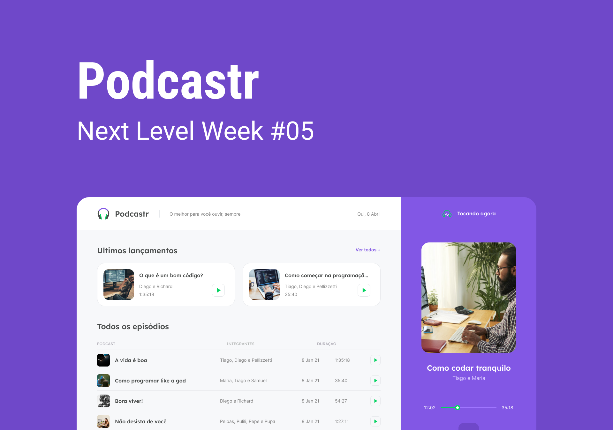

<div align='center'>
  <h1>Podcastr</h1>
  
  
  
</div>

## 🤔 Sobre o Projeto
O Podcastr é uma plataforma usada para ouvir um podcast desenvolvido durante os dias 19 a 25 durante o **Next Level Week**

## 🖥 Tecnologias
O Podcastr foi construindo usando essas tecnologias:

### Dependências do Projeto
- [Next.js](https://nextjs.org)
- [Sass](https://sass-lang.com/)
- [Date FNS](https://date-fns.org/)

### Dependências de Desenvolvimento
- [TypeScript](https://www.typescriptlang.org)
- [VSCode](https://code.visualstudio.com/)
- [REST Client (VSCode Extension)](https://marketplace.visualstudio.com/items?itemName=humao.rest-client)

## 🚀 Como executar o projeto

Para executar o projeto, siga esses passos:
```bash
# Clone o repositorio
git clone https://github.com/Guigalaverna/podcastr

# Entre no projeto
cd podcastr

# Instale as dependencias
npm install

# Inicie a API
npm run server

# E em outro terminal execute
npm run build && npm start
```

**Obs: Como o objetivo do NLW foi React, a API construída é estática**

## 🙋‍♂️ Contribuindo

Se você estiver disposto a contribuir com o projeto, siga esses passos:

1. Faça um fork do projeto
2. Clone localmente
3. Faça sua alteração
4. Crie uma PR com suas alterações

## ❤ Ajudinha

Se esse projeto de ajudou de alguma forma, considere dar uma star no projeto
